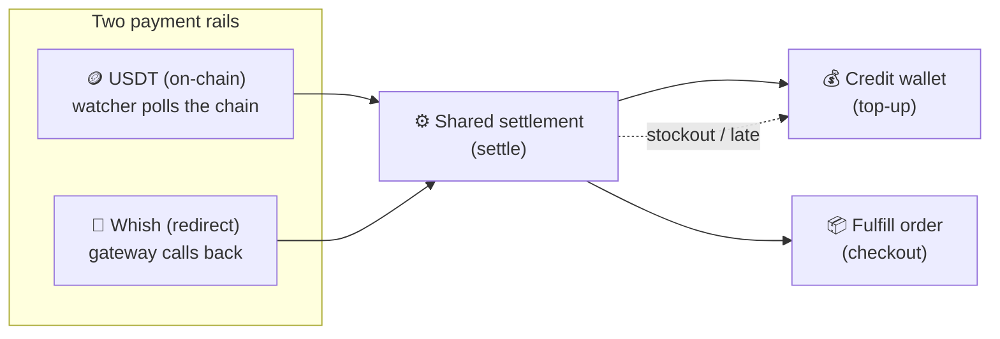
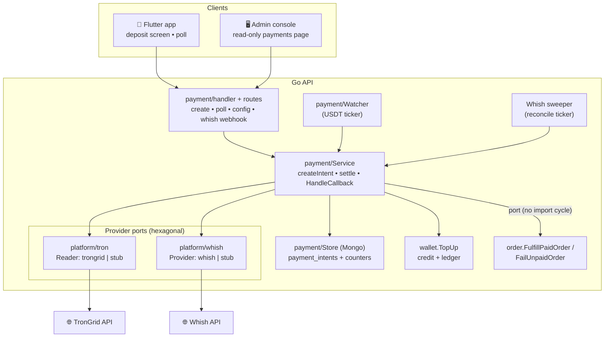
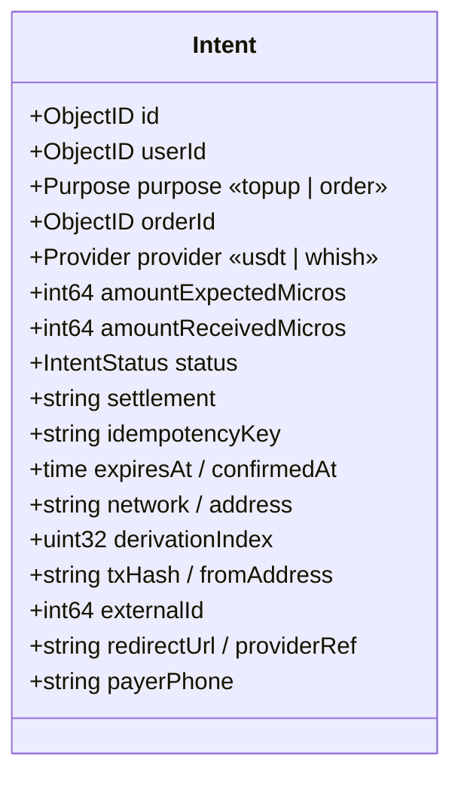
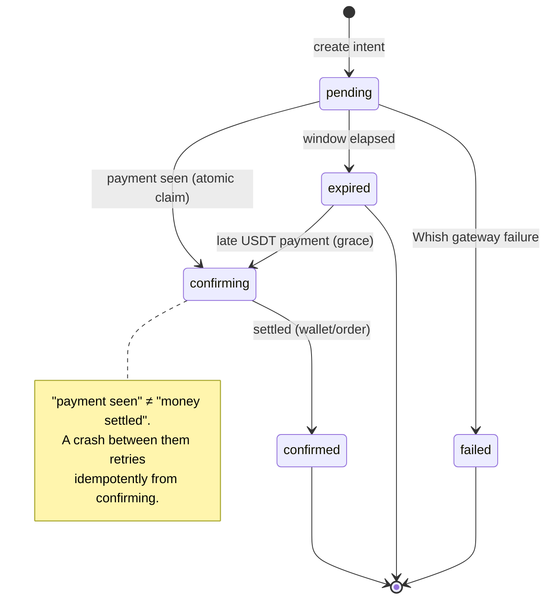
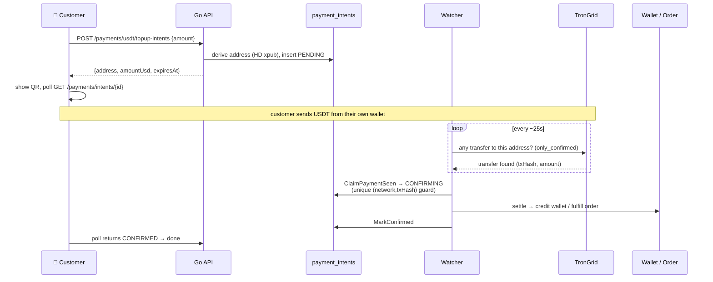
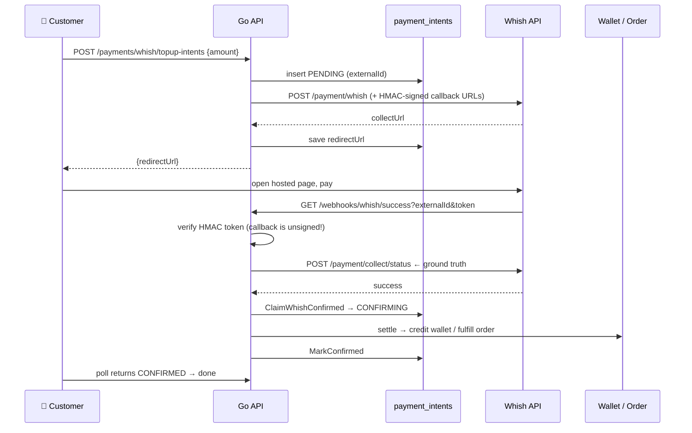
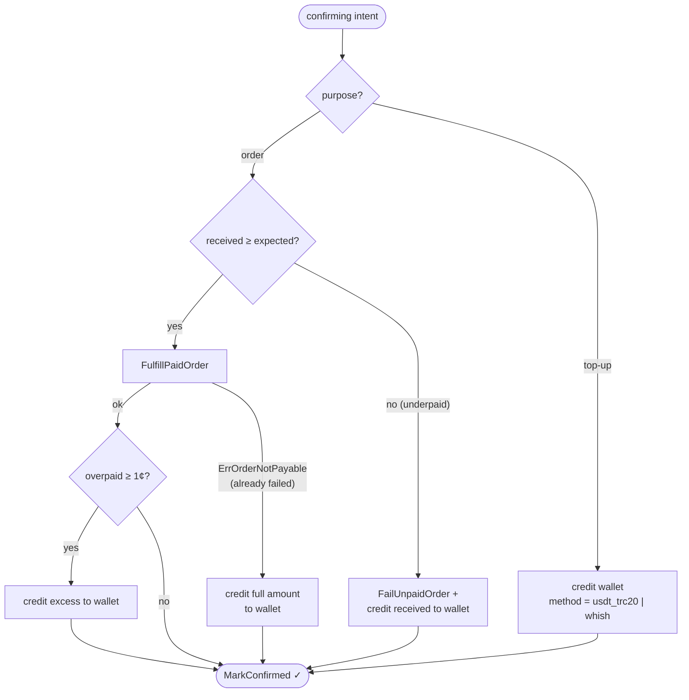
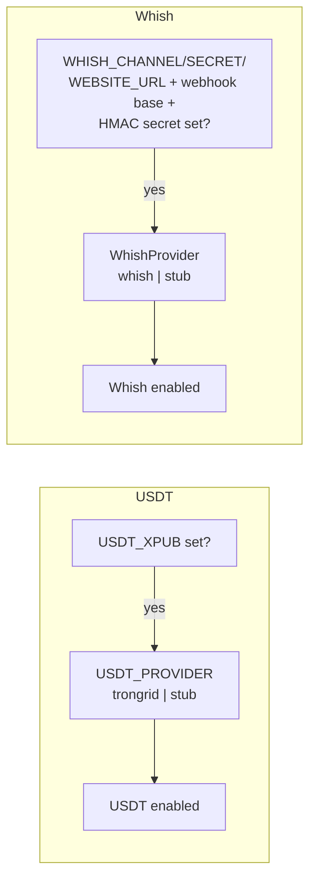

# SalehCard Payments — Implementation Overview

How automatic, no-admin-in-the-loop payments work in SalehCard: **one async
payment module** with **two interchangeable rails** — **USDT** (on-chain crypto)
and **Whish** (Lebanese redirect wallet) — feeding **one shared settlement path**
that credits the wallet or fulfills an order.

> **Status (2026-07-06):** USDT is on PR #51 (verified stub-mode). Whish is
> code-complete + stub-verified, not yet committed. Both are **dark by default** —
> each turns on only when its env config is present.

---

## 1. The big idea

A customer pays; **money moves automatically**; no admin approves anything. The two
rails differ only in *how a payment is detected* — after that, they converge:

The key contrast — and why they can't share detection code:

| | 🪙 **USDT** | 📱 **Whish** |
|---|---|---|
| Who holds the money | **You** (your own addresses) | Whish, then pays you out |
| Third-party gateway | ❌ none | ✅ Whish hosted checkout |
| External API needed | ✅ **TronGrid** (read the chain) | ✅ **Whish REST API** |
| How you start | derive a deposit address, show a **QR** | `POST /payment/whish` → **redirect** to a hosted page |
| How you learn it's paid | a **background watcher polls** TronGrid | Whish fires a **server callback**, you **re-poll** its status API |
| Ground truth | the blockchain | Whish's `collect/status` (never the callback URL that fired) |
| Double-credit guard | unique `(network, txHash)` | unique `(provider, externalId)` |
| Dev without any network | `stub` adapter auto-confirms | `stub` adapter auto-confirms |

---

## 2. Components

**Why ports?** `platform/tron` and `platform/whish` each expose a small interface
with real + `stub` adapters selected by an env var (`USDT_PROVIDER`,
`WhishProvider`). Swap providers by config; dev needs no external service.

**Why the order arrow is a port:** `order` imports `payment` (to create intents),
so `payment` can't import `order`. Instead `payment` defines the `OrderSettler`
interface, and `server.go` wires the concrete order service back in via
`paySvc.SetOrderSettler(orderSvc)`.

---

## 3. The Intent — one document, two shapes

Every payment is one `payment_intents` document. Shared fields drive settlement;
provider-specific fields are only populated for their rail.

**Money is `int64` micro-USDT internally** (6 decimals = the TRC20 base unit) so
on-chain amounts never touch floats. It converts to a USD `float64` only at the
wallet/order boundary and in the JSON the client sees. `1 USDT = 1 USD`.

### State machine

- `confirming` is the **atomic claim** that separates *seeing* a payment from
  *settling* it — the crash-safety hinge.
- USDT never hits `failed` (settlement just retries); `failed` is Whish-only
  (gateway said the payment failed).
- `expired → confirming` is the **USDT late-payment grace**: a transfer that
  lands after expiry is still credited (to the wallet, never order fulfillment).

---

## 4. Flow — USDT (on-chain)

The **Watcher** is the codebase's first long-running worker. Each tick does three
things: **(1)** expire overdue intents, **(2)** retry any stuck `confirming`
settlements, **(3)** scan the chain for new payments. Running two instances is
safe — atomic claims + the unique `txHash` index make double-credit impossible.

---

## 5. Flow — Whish (redirect)

Three Whish-specific safeguards (ported from LACPA):
- **The callback is unsigned** → the caller could be anyone. Authentication is the
  **HMAC token** appended to the callback URL and verified on receipt.
- **Never trust which URL fired.** The browser can land on the *failure* redirect
  even when the payment succeeded, so the handler **re-polls `collect/status`** and
  trusts that.
- **A lost callback won't strand money.** A **sweeper** ticks over expired-but-
  pending Whish intents and re-polls the gateway before giving up — a late success
  still settles.

---

## 6. Settlement — the shared path

Once either rail reaches `confirming`, `settle()` is identical. It is **retried
until it succeeds**, so every branch is idempotent.

**Money is never stranded:** stockout, late arrival, or underpayment on an order
all fall back to a **wallet credit** rather than failing silently.

**Idempotency backbone** — three atomic guards mean a retry (or a duplicate
callback, or a second watcher) can't double-charge:

| Guard | Where | Protects against |
|---|---|---|
| unique `(network, txHash)` | payment_intents | recording one transfer on two intents |
| unique `(provider, externalId)` | payment_intents | duplicate Whish callback creating dupes |
| unique `(method, ref)` | wallet_transactions | crediting the wallet twice for one intent |

The wallet-ledger `(method, ref)` guard is the linchpin: a settlement retry that
*already* credited hits the duplicate, `wallet.TopUp`'s own compensation reverses
the second balance bump, and the retry proceeds as "already done".

---

## 7. Config & feature gates

Both rails are **off unless configured** — safe to ship dark.

- **`GET /api/v1/payments/config`** tells the client which rails are on
  (`usdtEnabled`, and the Whish equivalent), so the UI only shows available options.
- Prod safety: `config.Validate` refuses to boot `stub` + a real xpub outside
  development (the stub auto-confirms *unpaid* payments — catastrophic in prod).
- Secrets (`USDT_XPUB`, `TRONGRID_API_KEY`, `WHISH_SECRET`, `PAYMENTS_HMAC_SECRET`)
  live in env / Azure app settings, never in the repo. The mnemonic behind the xpub
  **never touches the server** (watch-only derivation).

---

## 8. HTTP surface

| Method / Path | Auth | Purpose |
|---|---|---|
| `POST /api/v1/payments/usdt/topup-intents` | customer JWT | open a USDT top-up intent |
| `POST /api/v1/payments/whish/topup-intents` | customer JWT | open a Whish top-up intent |
| `GET /api/v1/payments/intents/{id}` | customer JWT | **poll** an intent's status |
| `GET /api/v1/payments/config` | customer JWT | feature gate for the UI |
| `GET /api/v1/payments/webhooks/whish/{success\|failure}` | **HMAC token** | Whish server callback (public, no JWT) |
| `GET /api/admin/payments` + `/{id}` | admin JWT | read-only ops view (Tronscan links) |

Order checkout doesn't add routes — `POST /orders` with `paymentMethod: usdt`
(or `whish`) creates the intent and returns the order **pending** with its
`paymentIntent` attached; the watcher/callback fulfills it later via the
`OrderSettler` port.

---

## 9. Clients

- **Flutter** (`app/lib/features/payments/`): a data/domain/presentation slice
  (mirrors the wallet feature), a **deposit screen** (USDT: QR + copy + expiry
  countdown + lifecycle-aware poll; Whish: open the `redirectUrl`), and entry
  points in the **top-up** screen and **checkout** payment selector — each shown
  only when its rail is enabled by `/payments/config`.
- **Admin** (`admin/src/features/payments/`): a read-only, filterable list of all
  intents with the owning customer, amount, settlement outcome, and **Tronscan**
  deep links — for support/monitoring (settlement itself is automatic).

---

## 10. Verification & what's left

**Verified (stub mode, end-to-end):** USDT + Whish top-ups credit the wallet;
USDT order fulfills with the wallet untouched; Go `build`/`vet`/`test`,
`flutter analyze`, and admin `build`/`lint` all green.

**Deferred before go-live** (`DEVOPS-TODO.md`, `QA-TODO.md`):
- USDT: generate the xpub **offline**, TronGrid key, App Service **Always On**,
  fund-sweep runbook; real-chain small-value test matrix.
- Whish: obtain **SalehCard's own** merchant credentials (the shared LACPA creds
  are reference/sandbox only), a public callback URL (tunnel in dev), and the
  sandbox test-phone/OTP matrix.

---

### File map

| Concern | Path |
|---|---|
| Payment module | `api/internal/modules/payment/` (`model`, `repository`, `service`, `handler`, `routes`, `admin`, `watcher`, `sweeper`, `token`) |
| USDT chain reader | `api/internal/platform/tron/` |
| Whish gateway | `api/internal/platform/whish/` |
| Wallet credit | `api/internal/modules/wallet/service.go` (`TopUp`) |
| Order settlement | `api/internal/modules/order/service.go` (`FulfillPaidOrder`, `FailUnpaidOrder`) |
| Wiring | `api/internal/server/server.go`, `api/cmd/server/main.go` |
| Flutter | `app/lib/features/payments/` |
| Admin | `admin/src/features/payments/` |
