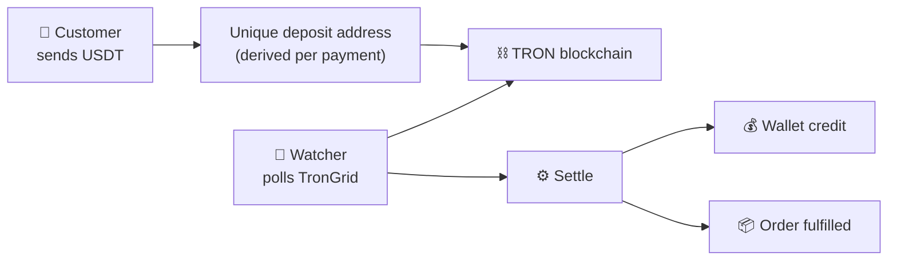
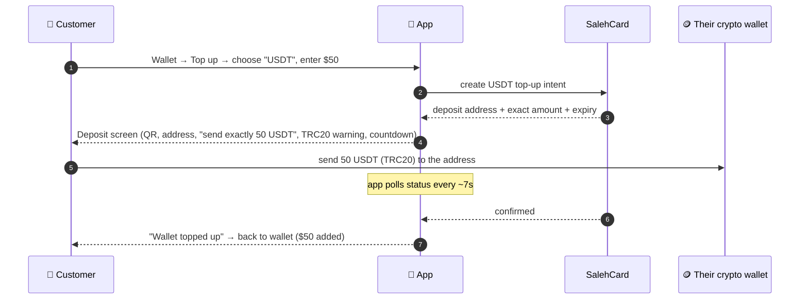
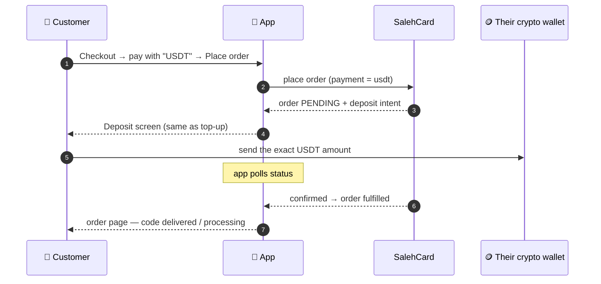
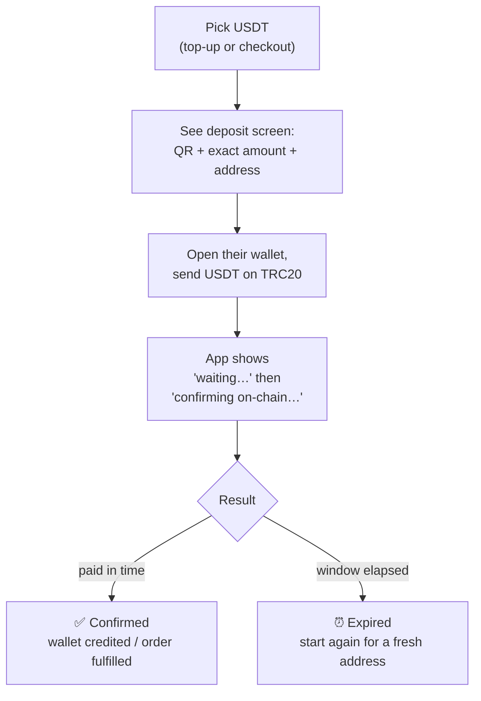

# USDT Payments — Technical Brief & Customer Flow

Two views of the same feature: a **technical brief** for engineers/stakeholders,
and a **customer flow** for product/support. USDT (TRC20) only.

> **Status (2026-07-06):** code-complete, verified in stub mode, on PR #51. Dark
> by default — turns on only when `USDT_XPUB` is set in prod.

---

# Part 1 — Technical Brief

## What it is

Customers pay in **USDT (Tether) on the TRON network (TRC20)**. Payment is
**detected and settled automatically** — no third-party payment gateway, no admin
approval. It funds either a **wallet top-up** or a **direct order checkout**.

## How it works (in five lines)

1. Each payment gets a **unique deposit address**, derived on the server from the
   owner's watch-only wallet key (`xpub`) — no private keys on the server.
2. The customer sends USDT to that address from their own wallet.
3. A **background watcher** polls the **TronGrid** API for the incoming transfer.
4. On a confirmed transfer, a **shared settlement step** credits the wallet or
   fulfills the order.
5. The app **polls** the payment status and moves the customer on when it confirms.

## Key properties

| Property | How |
|---|---|
| **No gateway** | Customer sends directly to your address; you're the settlement rail |
| **Auto-confirm** | Watcher polls TronGrid (`only_confirmed` transfers) — no manual step |
| **Own the funds** | Deposits land on owner-controlled addresses (swept later) |
| **Money units** | `int64` micro-USDT internally (no float bugs); `1 USDT = 1 USD` |
| **No double-credit** | Unique `(network, txHash)` index + unique wallet `(method, ref)` index |
| **Never stranded** | Stockout / late / underpaid all fall back to a wallet credit |
| **Feature-gated** | Enabled only when `USDT_XPUB` set; `stub`+xpub refused outside dev |

## Moving parts

| Component | Role |
|---|---|
| `modules/payment` | intent state machine, store, settlement, the **watcher** |
| `platform/tron` | TronGrid adapter (real) + stub (dev), watch-only address derivation |
| `wallet.TopUp` | credits the wallet + writes the ledger row (idempotent by ref) |
| `order.FulfillPaidOrder` / `FailUnpaidOrder` | order settlement callbacks |

## Setup to go live (owner)

- Generate a wallet **offline**, derive the TRON account `xpub` → `USDT_XPUB`
  (mnemonic never touches the server).
- Create a **TronGrid** API key → `TRONGRID_API_KEY`; set `USDT_PROVIDER=trongrid`.
- Ensure the API host runs the watcher continuously (App Service **Always On**).
- Have a **sweep** procedure to move collected USDT to treasury.

In **dev**, none of this is needed: `USDT_PROVIDER=stub` auto-confirms after a delay.

---

# Part 2 — Customer USDT Payment Flow

What the customer actually experiences. Two entry points: **topping up their
wallet**, and **paying for an order at checkout**. Both converge on the same
**deposit screen**.

## A) Wallet top-up

**What the customer sees on the deposit screen:**
- A **QR code** of the deposit address (scan from their wallet app).
- The **exact amount** to send and a **copy** button.
- The **address** and a **copy** button.
- A **⚠️ "Send only USDT on TRC20"** warning (wrong network/coin = lost funds).
- A **countdown** to expiry (default 30 min).
- A "waiting for your payment…" spinner that updates live.

## B) Order checkout

The order sits **pending** (no stock reserved) until payment confirms, then it's
fulfilled automatically. The wallet is **not** touched — this is a direct crypto
payment for the order.

## The customer's step-by-step

## Edge cases (and what the customer gets)

| Situation | What happens | Customer sees |
|---|---|---|
| Pays the **exact amount** in time | Confirmed → wallet credited or order fulfilled | ✅ success screen |
| **Overpays** an order | Order fulfilled; the **extra** is added to their wallet | ✅ + wallet bump |
| **Underpays** an order | Order cancelled; the **amount they sent** goes to their wallet | order failed, funds in wallet |
| Pays **after the window expired** | Still credited to their **wallet** (never lost) | wallet credit |
| Sends **wrong coin / wrong network** | ⚠️ Not recoverable by the app — this is why the TRC20 warning is prominent | — |
| Doesn't pay | Intent expires; for an order, the order is cancelled | ⏰ expired screen |

**The golden rule:** if the customer's money reaches an address we generated, it
is **credited to them** — as an order fulfillment when possible, otherwise as a
wallet balance. The only true loss is sending the wrong coin or wrong network,
which no system can reverse (hence the loud warning).

---

### One-line summary

> The customer sends USDT to a one-time address; our server watches the chain and,
> the moment the transfer confirms, automatically tops up their wallet or completes
> their order — with every failure mode falling back to crediting their wallet.
